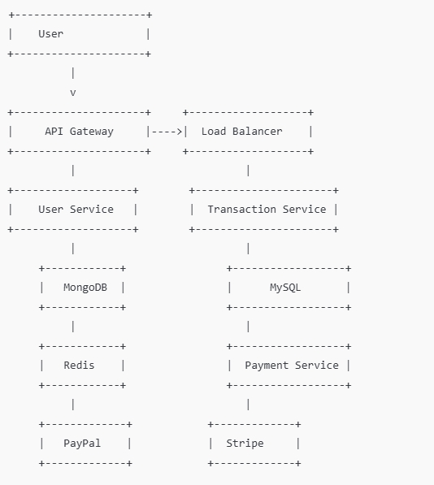

## configuration environment

npm: 10.9.0
node: v22.12.0
mongodb：8.0.4
mysql: 8.0.40

#### Please first establish a successful connection to the MySQL database
1. Host：localhost 
2. Port: 3306 
3. Username: root 
4. 密码: root
5. Create database named：secure-payment
5. Create a table named transactions
6. Create fields as shown in the table below
```markdown

| field name   | type      | desc                   | 
| id           | varchar   | primary-key long(255)  |
| userId       | varchar   |  long(255)             |
| amount       | float     |   float                |
| type         | tinytext  |  tinytext              |
```
#### Then establish a MongoDB connection
1. Host：localhost 
2. type: Standalone
2. Port: 27017
3. verify： None 
4. Create database name：secure-payment

#### all configuration is done !!!


1. git clone git@github.com:snowwest123/payment-node.git
2. npm install 
3. npm run dev


# Interview Task Completion Checklist

### 1. **API Development**
- [x] Create RESTful API with the following endpoints:
  - [x] User registration and authentication
  - [x] Initiating virtual credit transactions
  - [x] Retrieving user transaction history
- [x] Follow good code architecture principles:
  - [x] Separation of controllers, services, and repositories
  - [x] Use dependency injection to enhance testability and maintainability
  - [x] Implement consistent error handling strategies
- [x] Provide a Postman collection with example requests and responses for all API endpoints. Please refer to the details（payment-api-doc.postman_collection.json）

### 2. **Database Management**
- [x] Use MongoDB and MySQL to store user data and transaction records
  - [x] Store user data in MongoDB using Mongoose
  - [x] Store transaction records in MySQL using Sequelize
- [x] Ensure data integrity and optimize performance:
  - [x] Index optimization for MongoDB and MySQL
  - [x] Use transactions to ensure data consistency

### 3. **Security**
- [x] Implement JWT (JSON Web Tokens) for user authentication
  - [x] Generate and validate JWT
  - [x] Set expiration time and validity for the Token
- [x] Encrypt sensitive user information (e.g., passwords)
  - [x] Use bcrypt to hash passwords
- [x] Implement input validation and prevent SQL injection
  - [x] Use express-validator for input validation

### 4. **Microservices Architecture**
- [x] Break the application down into multiple independent microservices:
  - [x] User Service
  - [x] Transaction Service
  - [x] Payment Gateway Service
  - [x] API Gateway
- [x] Each microservice has its own database (MongoDB and MySQL)
- [x] Microservices communicate through the API Gateway and use JWT for user authentication

### 5. **Payment Gateway Integration**
- [x] Integrate a payment gateway (e.g., PayPal) to handle transactions:
  - [x] Use PayPal SDK to initiate payments
  - [x] Handle payment notifications and updates

### 6. **Documentation**
- [x] Provide clear API documentation:
  - [x] Request and response formats for each API endpoint
- [x] Provide a Postman collection file:
  - [x] Test all API endpoints via Postman
- [x] Provide a complete README file for the project:
  - [x] Setup and running instructions
  - [x] Environment variable configurations
  - [x] Dependency installation and running commands

### 8. **architecture diagram**
